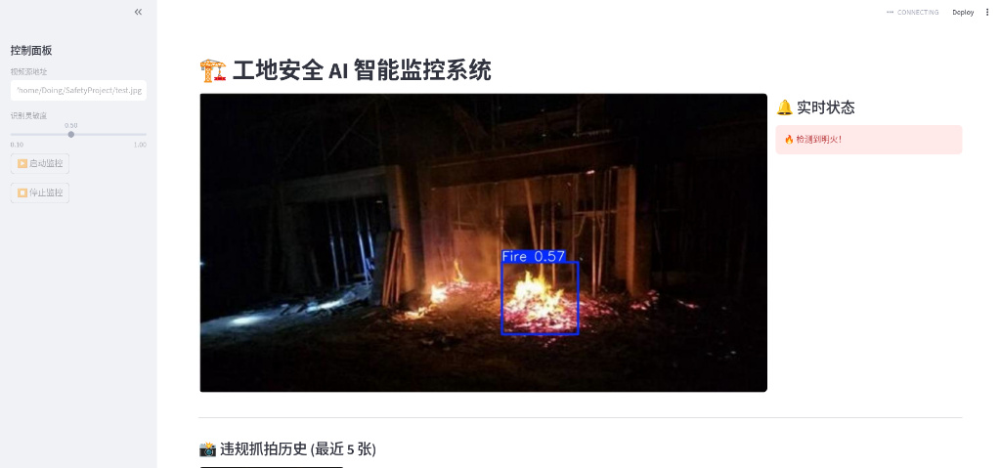

# 🏗️ SmartSite-Safety: AI Construction Monitoring

A high-performance safety surveillance system tailored for construction sites. Powered by **YOLOv8/v11**, it provides real-time multi-model inference to ensure worker safety and fire prevention.

## 📸 Preview



*Real-time fire detection and PPE compliance monitoring interface.*

## 🌟 Key Features

- **Dual-Model Parallel Inference**: 
  - **PPE Model**: Detects safety helmets, vests, gloves, and masks.
  - **Fire & Smoke Model (XL)**: High-precision hazard detection with robust filtering for welding sparks to minimize false alarms.
- **Web-based Control Tower**: Built with **Streamlit**, supporting RTSP streams, local cameras, and video files.
- **Violation Snapshots**: Automatically captures and archives the last 5 violation frames with visual bounding boxes.
- **Optimized for Linux**: Full compatibility with **Arch Linux** and optimized for mid-range hardware (e.g., Lenovo Legion R7000).

## 🚀 Quick Start

### 1. Clone the Repo
```bash
git clone [https://github.com/YourUsername/SmartSite-Safety.git](https://github.com/YourUsername/SmartSite-Safety.git)
cd SmartSite-Safety
````

### 2\. Environment Setup

Manage dependencies effortlessly with `uv`:

```bash
uv sync
```

### 📥 Model Weights Download

ppe_master.pt,~10 MB,https://raw.githubusercontent.com/a-arun-kumar/Construction-Site-Safety-Detection/master/models/ppe_master.pt
fire_smoke.pt,520 MB https://huggingface.co/SvenN/YOLOv8-Fire-and-Smoke-Detection/resolve/main/best.pt

> **Note**: After downloading the fire model, rename `best.pt` to `fire_smoke.pt` to match the code.

### 4\. Run the Dashboard

```bash
uv run streamlit run app.py
```

Access the UI via: `http://localhost:8501`

## 📸 Preview

Check out the `images/` directory for real-time detection samples, including fire alerts and PPE compliance checks.

## 🛠️ Deployment Tips

  - **Persistence**: Use `tmux` or `screen` to keep the service running in the background on Linux.
  - **Remote Alerts**: Integrated hooks available for [Memos](https://usememos.com/) to receive push notifications on mobile devices (e.g., OnePlus 15).

<!-- end list -->

````

